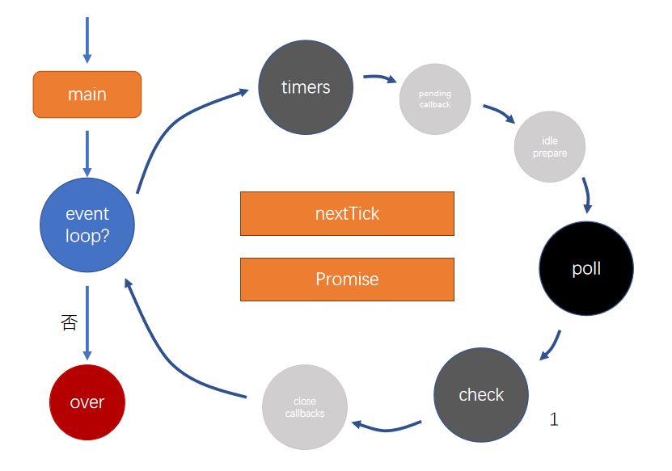

<!--
 * @Author: QinJiu
 * @Date: 2023-01-09 15:00:51
 * @LastEditors: Qinjiu
 * @LastEditTime: 2023-01-09 16:32:03
 * @Description: -
-->

## Node生命周期（事件循环机制）

;

### 宏任务

**==timers==** ---> pending callback ---> idle prepare ---> **==poll==** ---> **==check==** ---> close callbacks ---> 重新循环

前端需要掌握的三个阶段：

- **timers**：存放计时器的回调函数
  - setTimeout 等
- **poll**：轮询队列
  - 绝大部分回调都会放入该队列
  - 比如：文件的读取、监听用户请求等
  - **运作方式**
    - 如果 poll 中有回调，依次执行回调，直到清空队列
    - 如果 poll 中无回调
      - 等待其他队列中出现回调，结束该阶段，进入下一阶段
      - 如果其他队列中也没有回调，持续等待，直到出现回调
- **check**：检查阶段
  - 使用 setImmediate 的回调会**直接**进入这个队列

### 微任务

每次在执行回调之前，必须要先清空**nextTick**和**Promise**队列

nextTick 优先级高于 Promise

- **nextTick 队列**

- **Promise 队列**

### 练习

1. 微任务练习

```js
const promise = new Promise(function f1(resolve) {
  resolve();
  console.log(1);
});

promise.then(function f2() {
  console.log(2);
});

process.nextTick(function f3() {
  console.log(3);
});
```

分析：

- Promise 执行器为同步函数，首先执行 f1 函数
- f2 回调函数进入 Promise 队列
- f3 回调函数进入 nextTick 队列
- 进入事件循环，清空 nextTick 队列和 Promise 队列，nextTick 优先级高于 nextTick，所以执行顺序为 f3、f2
- 结果打印：1 3 2

2. 宏任务：timers 和 check 练习

```js
setTimeout(function f1() {
  console.log(1);
}, 0);

setImmediate(function f2() {
  console.log(2);
});
```

setTimeout 知识点： setTimeout(function fn() {}, 0);

> 即使 setTimeout 的延时设置为 0，延时也一定大于 0，假设最小延时为 1ms，系统会记录 setTimeout 执行的时间 start，通过轮询，判断当前时间 cur - start > 1 时，将回调函数加入 timers 队列等待执行

分析：

- 执行代码，记录 setTimeout 开始运行的时间 start，执行 setImmediate，将 f2 回调函数加入 check 队列
- 进入事件循环
- timers 阶段执行之前，之前的代码执行需要时间，系统轮询到时间 ==cur - start > 定时器延时时间== : 将 f1 回调函数加入 timers 队列
  - 进入 timers 阶段，执行 f1 回调函数，清空队列
  - 进入 poll 阶段：poll 阶段无回调函数，check 阶段存在回调
  - 进入 check 阶段，执行 f2 回调函数
  - ==结果打印：1 2==
- timers 阶段执行之前，之前的代码执行需要时间，系统一直轮询时间，直到进入 timers 阶段时 ==cur - start < 定时器延时时间== : 无操作
  - 进入 timers 阶段，无回调函数
  - 进入 poll 阶段：poll 阶段无回调函数，check 阶段存在回调
  - 进入 check 阶段，执行 f2 回调函数
  - 在 timers 阶段之后任一时间，系统轮询到时间 cur - start > 定时器延时时间 : 将 f1 回调函数加入 timers 队列，再次事件循环到达 timers 阶段时执行 f1 回调函数
  - ==结果打印：2 1==

3. 宏任务：timers 和 poll 练习

```js
// 当前代码既是index.js文件
const start = Date.now();
setTimeout(function f1() {
  console.log("setTimeout", Date.now() - start);
}, 500);

const fs = require("fs");

fs.readFile("./index.js", "utf-8", function f2() {
  console.log("readFile");
  const start = Date.now();
  while (Date.now() - start < 1000) {}
});
```

注：此文件较小，正常情况下 500ms 之内一定能读取出文件，此处只考虑正常情况

分析：

- 执行代码
- 进入事件循环
- 进入 timers 阶段：正常情况下，此时 timers 阶段无回调函数
- 进入 poll 阶段：此时无回调，等待其他队列中出现回调，文件读取成功后，f2 回电函数加入该队列，执行 f2，f2 中通过 while 循环，模拟延时 1000ms，在 f2 执行期间，系统轮询到 setTimeout 延时时间已到，将 f1 函数加入 timers 阶段，之后 f2 执行结束...
- 再次事件循环，timers 队列存在 f1 回调函数，执行 f1
- 结果：正常情况下
  - 依次打印 readFile setTimeout >1000 的数字
